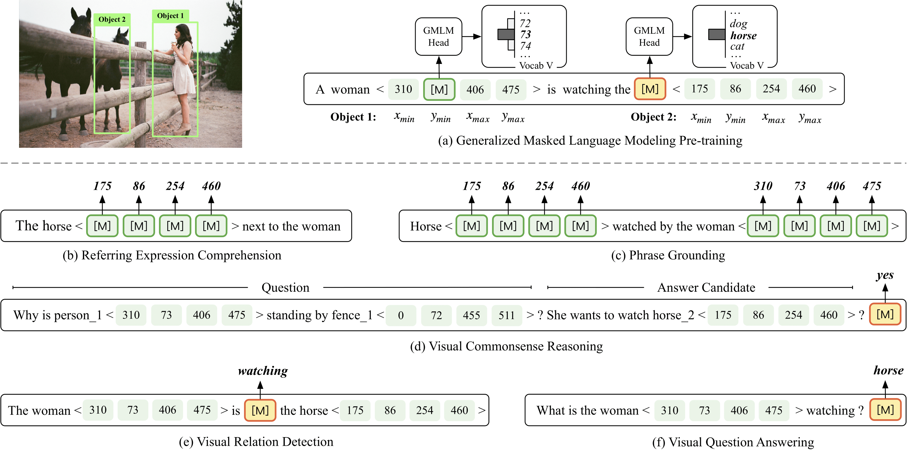

# PEVL

This is the official PyTorch implementation of the EMNLP 2022 paper "[PEVL: Position-enhanced Pre-training and Prompt Tuning for Vision-language Models](https://arxiv.org/abs/2205.11169)".

## Recent Updates
- [x] 2022.05.21 Update PEVL for grounding, VRD codes and second stage pre-trained models.
- [x] 2022.08.16 Train PEVL code for VCR tasks.

## Quick links

- [PEVL](#pevl)
  - [Quick links](#quick-links)
  - [Overview](#overview)
  - [Install](#install)
  - [Pretraining Instructions](#pretraining-instructions)
  - [Second Stage Pre-training and Fine-tuning](#second-stage-pre-training-and-fine-tuning)
    - [Referring Expression Comprehension](#referring-expression-comprehension)
    - [Phrase Grounding](#phrase-grounding)
    - [Visual Relation Detection](#visual-relation-detection)
    - [Visual Commonsense Reasoning](#visual-commonsense-reasoning)
  - [Citations](#citations)
  - [Acknowledgement](#acknowledgement)


## Overview
PEVL shows big gains of detector-free VLP models on position-sensitive tasks such as referring expression comprehension and phrase grounding, and also improves the performance on position-insensitive tasks with grounded inputs such as visual commomsense reasoning, visual relation detection and visual question answering(GQA).

This repository is currently under construction and will support pre-training on custom image-text datasets and datasets with object annotations, as well as fine-tuning on phrase grounding task (Flickr30k), referring expression comprehension (RefCOCO, RefCOCO+ and RefCOCOg), visual relation detection, visual commonsense reasoning and visual question answering(GQA).

PEVL enhances the pre-training and prompt tuning of VLP models with explicit object position modeling. Specifically, PEVL reformulates discretized object positions and language in a unified language modeling framework, which facilitates explicit VL alignment during pre-training, and also enables flexible prompt tuning for various downstream tasks. 



## Install
Please refer to [INSTALL](INSTALL.md).

## Pretraining Instructions
Before pretraining, we initialize PEVL's weights with the parameters of **[ALBEF\[14M\]](https://storage.googleapis.com/sfr-pcl-data-research/ALBEF/ALBEF.pth)**

Our raw pretraining corpus is from **[Visual Commonsense Reasoning(VCR)](https://visualcommonsense.com/download/)** and **[MDETR](https://arxiv.org/abs/2104.12763)** that collects images from Flickr30k entities, COCO, Visual Genome datasets. However, differently from MDETR, we split the sentences rather than use the combination of them.
- **[MDETR Data](https://zenodo.org/record/4729015/files/mdetr_annotations.tar.gz?download=1)**
- Download VCR data from the original websites.


## Second Stage Pre-training and Fine-tuning
You can download our first-stage pre-training model from **[pre-trained pevl](https://thunlp.oss-cn-qingdao.aliyuncs.com/pevl_pretrain.pth)**
We conduct second stage pre-training and fine-tuning for all downstream tasks.

### Referring Expression Comprehension
1. <a href="https://thunlp.oss-cn-qingdao.aliyuncs.com/grounding.pth"> Second stage pre-trained checkpoint </a> for position output tasks.
2. <a href="https://thunlp.oss-cn-qingdao.aliyuncs.com/pevl_grounding_data.tar.gz"> Dataset json files for position output downstream tasks</a>.(the 'file_name' in each json file need to be changed to your own directory)
3. In configs/visual_grounding.yaml, set the paths for the json files.
4. Fine-tuning the model using 4 V100 GPUs:
```bash
##RefCOCO:
###train
python -m torch.distributed.launch --nproc_per_node=4 --master_port=12451 --use_env run_grounding_train.py --train 1 --pretrain 0 --test_dataset refcoco --config ./configs/visual_grounding.yaml --output_dir ./output/visual_grounding/refcoco --checkpoint grounding.pth
###evaluate
python -m torch.distributed.launch --nproc_per_node=1 --master_port=12451 --use_env run_grounding_train.py --train 0  --pretrain 0 --test_dataset refcoco --config ./configs/visual_grounding.yaml --output_dir ./output/visual_grounding/refcoco_test --checkpoint [Finetuned checkpoint]

##RefCOCOg
###train
python -m torch.distributed.launch --nproc_per_node=4 --master_port=12451 --use_env run_grounding_train.py --train 1  --pretrain 0 --test_dataset refcocog --config ./configs/visual_grounding.yaml --output_dir ./output/visual_grounding/refcocog --checkpoint grounding.pth
###evalute
python -m torch.distributed.launch --nproc_per_node=1 --master_port=12451 --use_env run_grounding_train.py --train 0  --pretrain 0 --test_dataset refcocog --config ./configs/visual_grounding.yaml --output_dir ./output/visual_grounding/refcocog_test --checkpoint [Finetuned checkpoint]

##RefCOCO+
###train
python -m torch.distributed.launch --nproc_per_node=4 --master_port=12451 --use_env run_grounding_train.py --train 1  --pretrain 0 --test_dataset refcocop --config ./configs/visual_grounding.yaml --output_dir ./output/visual_grounding/refcocop --checkpoint grounding.pth
###evalute
python -m torch.distributed.launch --nproc_per_node=1 --master_port=12451 --use_env run_grounding_train.py --train 0  --pretrain 0 --test_dataset refcocop --config ./configs/visual_grounding.yaml --output_dir ./output/visual_grounding/refcocop_test --checkpoint [Finetuned checkpoint]

```

### Phrase Grounding
1. <a href="https://thunlp.oss-cn-qingdao.aliyuncs.com/grounding.pth"> Second stage pre-trained checkpoint </a> for position output tasks.
2. <a href="https://thunlp.oss-cn-qingdao.aliyuncs.com/pevl_grounding_data.tar.gz"> Dataset json files for position output downstream tasks</a>.(the 'file_name' in each json file need to be changed to your own directory)
3. In configs/visual_grounding.yaml, set the paths for the json files.
4. Fine-tuning the model using 8 V100 GPUs:
```bash
##Flickr30k
###train
python -m torch.distributed.launch --nproc_per_node=8 --master_port=12451 --use_env run_grounding_train.py --train 1 --pretrain 0 --test_dataset flickr --config ./configs/visual_grounding.yaml --output_dir ./output/phrase_grounding --checkpoint grounding.pth 
###evalute
python -m torch.distributed.launch --nproc_per_node=1 --master_port=12451 --use_env run_grounding_train.py --train 0 --pretrain 0 --test_dataset flickr --config ./configs/visual_grounding.yaml --output_dir ./output/phrase_grounding --checkpoint  [Finetuned checkpoint]

```

### Visual Relation Detection
1. <a href="https://thunlp.oss-cn-qingdao.aliyuncs.com/vrd.pth"> Second stage pre-trained checkpoint </a> for visual relation detection.
2. <a href="https://thunlp.oss-cn-qingdao.aliyuncs.com/pevl_vrd.tar.gz"> Dataset json files for visual relation detection</a>.(the 'file_name' in each json file need to be changed to your own directory)
3. In configs/visual_grounding.yaml, set the paths for the json files.
4. Fine-tuning the model using 8 V100 GPUs:
```bash
##for finetuning on visual genome:
python -m torch.distributed.launch --nproc_per_node=8 --master_port=12451 --use_env run_vrd_train.py --train 1 --pretrain 0 --mode finetune --config ./configs/vrd.yaml --output_dir ./output/vrd --checkpoint vrd.pth

##for evaluation on visual genome:
python -m torch.distributed.launch --nproc_per_node=1 --master_port=12451 --use_env run_vrd_train.py --train 0 --pretrain 0 --config ./configs/vrd.yaml  --checkpoint [Finetuned checkpoint]
```


### Visual Commonsense Reasoning
1. <a href="https://thunlp.oss-cn-qingdao.aliyuncs.com/pevl_vcr.tar.gz"> Dataset json files for visual commonsense reasoning</a>.(the 'file_name' in each json file need to be changed to your own directory)
2. In configs/vcr.yaml, set the paths for the json files.


## Citations
If you find this project helps your research, please kindly consider citing our paper in your publications.
```
@article{yao2022pevl,
  title={PEVL: Position-enhanced Pre-training and Prompt Tuning for Vision-language Models},
  author={Yao, Yuan and Chen, Qianyu and Zhang, Ao and Ji, Wei and Liu, Zhiyuan and Chua, Tat-Seng and Sun, Maosong},
  journal={arXiv preprint arXiv:2205.11169},
  year={2022}
}
```

## Acknowledgement
The implementation of PEVL relies on resources from <a href="https://github.com/salesforce/ALBEF">ALBEF</a> especially, <a href="https://github.com/huggingface/transformers">Huggingface Transformers</a>, and <a href="https://github.com/rwightman/pytorch-image-models/tree/master/timm">timm</a>. We thank the original authors for their open-sourcing and excellent work.
